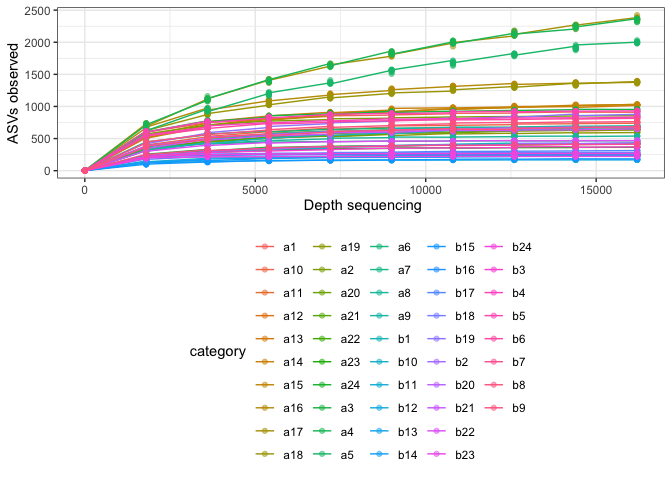
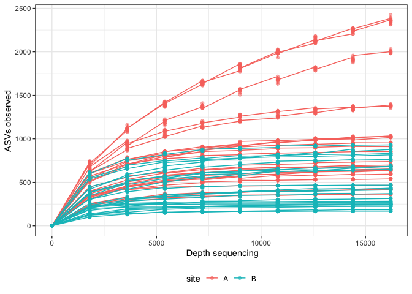

Rarefy clean data and plot
================

## Resource

All the functions are contained in `funs_rarefy.R` in `scripts`
directory.

``` r
source("scripts/funs_rarefy.R")
```

## Dataset preparation

The dataset that QIIME2 returns is called `observed_features.csv` and it
was obtained with the `qiime diversity alpha-rarefaction plugin`.
Usually, the dataset has a column for samples names (`sample_id`) at the
begining and other categorical columns like `description`, `site`, etc.
at the end it depends on your project.

The dataset looks like this:

To use the functions contained in `funs_rarefy.R` you have to choose one
character column, your sample ids or a categorical variable. In this
case I’ll use my sample-ids, at the end of this dataset I have a categorical
variable called `site`, I’ll delete it.

``` r
library(tidyverse)
```

    ## ── Attaching packages ─────────────────────────────────────── tidyverse 1.3.1 ──

    ## ✓ ggplot2 3.3.3     ✓ purrr   0.3.4
    ## ✓ tibble  3.1.1     ✓ dplyr   1.0.5
    ## ✓ tidyr   1.1.3     ✓ stringr 1.4.0
    ## ✓ readr   1.4.0     ✓ forcats 0.5.1

    ## ── Conflicts ────────────────────────────────────────── tidyverse_conflicts() ──
    ## x dplyr::filter() masks stats::filter()
    ## x dplyr::lag()    masks stats::lag()

``` r
library(magrittr)
```

    ## 
    ## Attaching package: 'magrittr'

    ## The following object is masked from 'package:purrr':
    ## 
    ##     set_names

    ## The following object is masked from 'package:tidyr':
    ## 
    ##     extract

``` r
obs %<>% select(-site)
```

## Process

### First step: Data cleaning

We have to clean the colnames of the dataset, in order to obtain only
the depth of reads and the number of the iterations. Remember that for
each depth there are 10 iterations. The first function
(`clean_rarefy_data()`) do that.

**Parameters** of `clean_rarefy_data()`: 
- `data` : A dataset with just
one categorical column. 
- `catCol`: 1 or 101, the number represents de
number of the categorical column, could be: 1 if your column are at
the beginig or 101 if you column are at the end

**Output**: A list, each object of that list is a dataset. The number of
datasets contained in the list depends on the number of samples or
categories you have. Each dataset contains the 10 iterations from each
read depth.

``` r
obs1 <- clean_rarefy_data(obs, 1)
obs1[[1]]
```

    ## # A tibble: 100 x 3
    ##    sample_id Depth sequences
    ##    <chr>     <chr>     <int>
    ##  1 a1        1             1
    ##  2 a1        1             1
    ##  3 a1        1             1
    ##  4 a1        1             1
    ##  5 a1        1             1
    ##  6 a1        1             1
    ##  7 a1        1             1
    ##  8 a1        1             1
    ##  9 a1        1             1
    ## 10 a1        1             1
    ## # … with 90 more rows

### Second step: Mean and sd

The second step is to obtain the average and the standard deviation of
the number of sequences obtained in each iteration at each depth. We can
do that with the function `rarefy_by()`.

**Parameters**: `L`: The list obtained in the last step.

**Output**: Another list.

``` r
obs2 <- rarefy_by(obs1)
obs2[[1]]
```

    ## # A tibble: 10 x 3
    ##    Depth  mean    sd
    ##    <chr> <dbl> <dbl>
    ##  1 1        1   0   
    ##  2 10800  888.  4.35
    ##  3 12600  900.  4.83
    ##  4 14400  910.  3.75
    ##  5 16200  914.  3.01
    ##  6 1800   589  11.3 
    ##  7 3600   750. 10.9 
    ##  8 5400   808.  6.54
    ##  9 7200   848.  5.52
    ## 10 9000   873.  6.68

### Third step: More data cleaning

So, at this time we have the mean and sd of the 10 iterations for each
depth. Now, we have to transform the column `Depth` to a numeric and
unite all objects in the list into one dataset. In order to do this, we
use the function `clean_rarefy_data2()`.

**Parameters**: `L`: The list obtained in the last step.

``` r
obs3 <- clean_rarefy_data2(obs1)
class(obs3)
```

    ## [1] "data.frame"

``` r
head(obs3)
```

    ##   category sample_id sequences depth
    ## 1       a1        a1         1     1
    ## 2       a1        a1         1     1
    ## 3       a1        a1         1     1
    ## 4       a1        a1         1     1
    ## 5       a1        a1         1     1
    ## 6       a1        a1         1     1

### Fourth step: Plot

Finally just plot the last object.

``` r
ggplot(obs3, aes(x = depth, 
                 y = sequences,
                 group = category,
                 color = category)) +
    geom_line() +
    geom_point(alpha = 0.5)+
    theme_bw() +
    theme(legend.position = "bottom")+
    labs(x =" Depth sequencing", 
         y = "ASVs observed") 
```

<!-- -->

Or you could add another column with more categories like site or
treatment and get a plot with more information.

``` r
obs3 %<>% mutate(site = ifelse(grepl("^a", .$category), "A", "B"))
head(obs3)
```

    ##   category sample_id sequences depth site
    ## 1       a1        a1         1     1    A
    ## 2       a1        a1         1     1    A
    ## 3       a1        a1         1     1    A
    ## 4       a1        a1         1     1    A
    ## 5       a1        a1         1     1    A
    ## 6       a1        a1         1     1    A

Plot

``` r
ggplot(obs3, aes(x = depth, 
                 y = sequences,
                 group = category,
                 color = site)) +
    geom_line() +
    geom_point(alpha = 0.5)+
    theme_bw() +
    theme(legend.position = "bottom")+
    labs(x =" Depth sequencing", 
         y = "ASVs observed") 
```

<!-- -->
