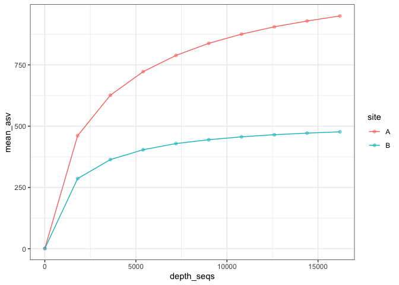
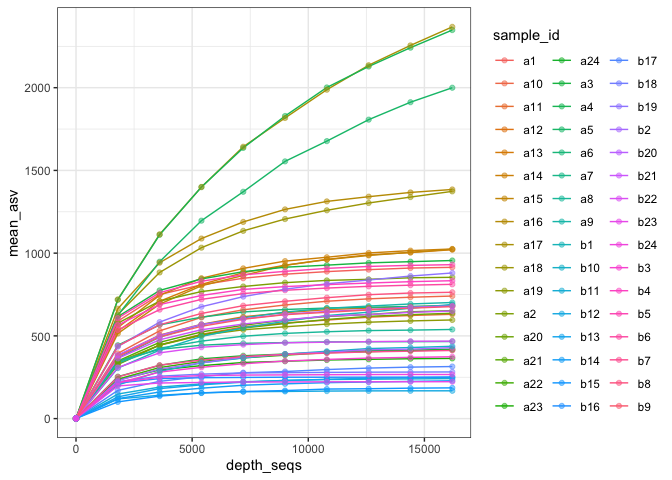

Rarefy clean data and plot
================
Luis-Vargas, Maira N.

email: <nayeli.luis@ciencias.unam.mx>

## Resource

All the functions are contained in `funs_rarefy.R` in `scripts`
directory.

``` r
source("../scripts/funs_rarefy2.R")
```

    ## ── Attaching packages ─────────────────────────────────────── tidyverse 1.3.1 ──

    ## ✔ ggplot2 3.3.6     ✔ purrr   0.3.4
    ## ✔ tibble  3.1.7     ✔ dplyr   1.0.9
    ## ✔ tidyr   1.2.0     ✔ stringr 1.4.0
    ## ✔ readr   2.1.2     ✔ forcats 0.5.1

    ## ── Conflicts ────────────────────────────────────────── tidyverse_conflicts() ──
    ## ✖ dplyr::filter() masks stats::filter()
    ## ✖ dplyr::lag()    masks stats::lag()

    ## 
    ## Attaching package: 'magrittr'

    ## The following object is masked from 'package:purrr':
    ## 
    ##     set_names

    ## The following object is masked from 'package:tidyr':
    ## 
    ##     extract

## Dataset preparation

The dataset that QIIME2 returns is called `observed_features.csv` and it
was obtained with the `qiime diversity alpha-rarefaction plugin`.
Usually, the dataset has a column for samples names (`sample_id`) at the
begining and other categorical columns like `description`, `site`, etc.
at the end it depends on your project.

The dataset looks like this:

## First step: Data cleaning

In order to do this we will use the function `clean_data()`. this
function reformat the dataset and separate the columns by
`depth_seqs()`, `iter` and `asvs`.

``` r
obs_long <- clean_data(obs)
head(obs_long)
```

    ## # A tibble: 6 × 5
    ##   sample_id site  depth_seqs iter   asvs
    ##   <chr>     <chr> <chr>      <chr> <int>
    ## 1 a1        A     1          1         1
    ## 2 a1        A     1          2         1
    ## 3 a1        A     1          3         1
    ## 4 a1        A     1          4         1
    ## 5 a1        A     1          5         1
    ## 6 a1        A     1          6         1

## Second step: Get the mean of observed ASVs

The second step is to obtain the mean aof the number of ASVs observerd
in each iteration at each depth. first, we have to nest our dataset in
function of a variable, could be a categorical variable or the name of
our samples.

``` r
obs_nest <- obs_long %>% 
  group_by(depth_seqs, site) %>% 
  nest()
head(obs_nest)
```

    ## # A tibble: 6 × 3
    ## # Groups:   depth_seqs, site [6]
    ##   site  depth_seqs data              
    ##   <chr> <chr>      <list>            
    ## 1 A     1          <tibble [240 × 3]>
    ## 2 A     1800       <tibble [240 × 3]>
    ## 3 A     3600       <tibble [240 × 3]>
    ## 4 A     5400       <tibble [240 × 3]>
    ## 5 A     7200       <tibble [240 × 3]>
    ## 6 A     9000       <tibble [240 × 3]>

To check the kind of object `obs_nest`:

``` r
class(obs_nest)
```

    ## [1] "grouped_df" "tbl_df"     "tbl"        "data.frame"

To acces data:

``` r
obs_nest$data[[1]]
```

    ## # A tibble: 240 × 3
    ##    sample_id iter   asvs
    ##    <chr>     <chr> <int>
    ##  1 a1        1         1
    ##  2 a1        2         1
    ##  3 a1        3         1
    ##  4 a1        4         1
    ##  5 a1        5         1
    ##  6 a1        6         1
    ##  7 a1        7         1
    ##  8 a1        8         1
    ##  9 a1        9         1
    ## 10 a1        10        1
    ## # … with 230 more rows

Finally, we can get the mean of observed ASVs with `asvs_mean()`
fuction.

``` r
obs_mean <- mutate(
  obs_nest, mean_asv = map_dbl(.x = data, .f = asvs_mean)
) %>% 
  select(-data)

# Convert depth_seqs in a numeric variable
obs_mean$depth_seqs <- sapply(obs_mean$depth_seqs, as.numeric)

head(obs_mean)
```

    ## # A tibble: 6 × 3
    ## # Groups:   depth_seqs, site [6]
    ##   site  depth_seqs mean_asv
    ##   <chr>      <dbl>    <dbl>
    ## 1 A              1       1 
    ## 2 A           1800     461.
    ## 3 A           3600     626.
    ## 4 A           5400     723.
    ## 5 A           7200     789.
    ## 6 A           9000     838.

## Third step: Plot

Finally just plot the last object.

``` r
obs_mean %>% 
  ggplot(aes(x = depth_seqs,
             y = mean_asv, 
             color = site)) +
  geom_line() +
  geom_point(alpha = 0.5) +
  theme_bw() 
```

<!-- -->

## To plot each sample

``` r
# Group by sample_id
obs_sample <- obs_long %>% 
  group_by(depth_seqs, sample_id) %>% 
  nest()

# Get mean of asvs by sample
obs_mean_sample <- mutate(
  obs_sample, mean_asv = map_dbl(.x = data, .f = asvs_mean)
) %>% 
  select(-data)

# Convert depth_seqs in a numeric variable
obs_mean_sample$depth_seqs <- sapply(obs_mean_sample$depth_seqs, as.numeric)

# Check dataset
head(obs_mean_sample)
```

    ## # A tibble: 6 × 3
    ## # Groups:   depth_seqs, sample_id [6]
    ##   sample_id depth_seqs mean_asv
    ##   <chr>          <dbl>    <dbl>
    ## 1 a1                 1       1 
    ## 2 a1              1800     589 
    ## 3 a1              3600     750.
    ## 4 a1              5400     808.
    ## 5 a1              7200     848.
    ## 6 a1              9000     873.

``` r
# plot
obs_mean_sample %>% 
  ggplot(aes(x = depth_seqs,
             y = mean_asv, 
             color = sample_id)) +
  geom_line() +
  geom_point(alpha = 0.5) +
  theme_bw()
```

<!-- -->
