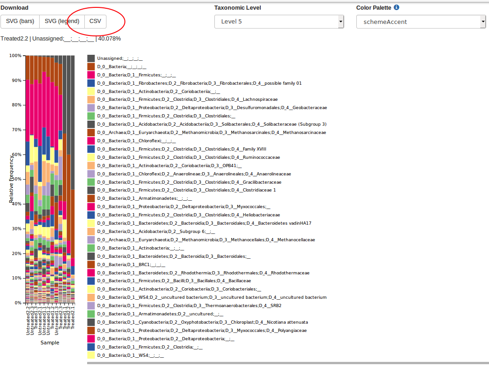

email: nayeli.luis@ciencias.unam.mx

```{r setup, include=FALSE}
knitr::opts_chunk$set(echo = TRUE)
```

## Relative abundance

Relative abundance is a proportion of a specific taxa in the community and it may calculated by sample. Relative abundace is the ratio bewteen the number of sequences of and specific taxonomic group and the total sequences obtained in a sample.  


## Get data

To calculate relative abundance, we'll use two datasets, the file which contains de number of sequences after quality control, in my case I called it "denoising-stats.tsv" (it is in "datasets" directory) and the number of sequences per taxonomic group. To obtain the second file we need to use the plugin `qiime taxa barplot` after make the taxonomic classification and download the `.csv` files from each taxonomic hierarchy (level). See the image below. 


```{r, fig.align="center", out.height="90%", out.width = "90%", fig.cap="Taxa barplots from QIIME2 .\\label{taxaBarplot}"}
  
```

Remember:

  - level-1: Domain 
  - level-2: Phylum
  - level-3: Class
  - level-4: Order
  - level-5: Family
  - level-6: Genus
  - level-7: Specie

In "denoising-stats.csv" we have several columns indicating the number of recovered sequences after each process of quality control.

```{r, message=FALSE, warning=FALSE}
library(tidyverse)
library(magrittr)

total.seqs <- read.table("../datasets/denoising-stats.tsv", sep = '\t', header = TRUE)
names(total.seqs)

```

So, the idea is divide the number of sequences of some taxa from one taxonomic hierarchy ("level-x.csv") between the total of sequences (column 'non-chimeric' in "denoised-stats.tsv" file).

## Data wrangling 

From "denoised-stats.tsv" file we'll just use the column called 'non-chimeric' and the samples ids.  
```{r, message=FALSE, warning=FALSE}

total.seqs %<>% 
  select(sample.id, non.chimeric) %>%
  arrange()

head(total.seqs)
```

The datasets "level-x.csv" are a little more complicated. For this example I will use "level-2.csv", which corresponds to the taxonomic hierarchy of phylum. The dataset "level-2.csv" contains on the columns names: 1) a column called 'index' which contains your samples ids, 

```{r, message=FALSE, warning=FALSE}
phy <- read.csv("../datasets/level-2.csv", header = TRUE)
phy$index
```


2) Several columns with the taxonomy at the level of phylum including the domain,   

```{r, message=FALSE, warning=FALSE}
head(colnames(phy))
```

and , 3) at the end the dataset, the categorical varibles you assigned in your sample-metadata file. In this case, the categorical varibles are 'sample_type' and 'site'. 

```{r, message=FALSE, warning=FALSE}
tail(colnames(phy))
```

First, delete the categorical variables. 

```{r}
phy %<>% 
  select(-c(sample_type, site)) 
```

Then, you can use the function `rel_ab(dataTax, dataTotSeq, iTax, iTotSeq)` which is contained in "fun_relative_abundance.R" in "scripts" directory. This function has four parameters: 

  - `dataTax`: Dataset with groups of a taxonomic hierarchy (this case, `phy` from 'level-2.csv' file.)
  - `dataTotSeq`: Dataset with the samples names and the number of total sequences (`non.chimeric`) by sample. 
  - `iTax`: Column number where the samples names are found in dataTax (usually 1)
  - `iTotSeq`: Column number where the samples names are found in dataTax (usually 1).
  
```{r, warning=FALSE, message=FALSE}
source("../scripts/fun_relative_abundance.R")

relative.abundance.phy <- rel_ab(phy, total.seqs, 1, 1) 
```

Now, we have the proportion form each phylum detected by sample in the dataset `relative.abundance.phy`. 

```{r}
# Avoid scientific notation
options(scipen = 999999)
head(relative.abundance.phy[1:5], 5)
```

As you can notice, we lost our samples names, let's recover them. 

```{r}
rownames(relative.abundance.phy) <- phy$index
head(relative.abundance.phy[1:5], 5)
```

Usually, we want to know the most abundant taxa in the samples. So, we can filter the dataset with the function `filter_abundances()` in the script `fun_relative_abundance.R` in `scripts/` directory.
The function `filter_abundances()` has two parameters:
  - `dataRelAb`: The dataset with the relative abundances of each taxa (in this case 'relative.abundance.phy').
  - `filterValue`: The minimum value of relative abundance that we want. 

```{r}
source("../scripts/fun_relative_abundance.R")

phy.filtered <- filter_abundances(relative.abundance.phy, 0.10)
head(phy.filtered[1:5], 5)

```
```{r}
dim(phy.filtered)
```


And, It only remains to clear the names of the phyla. 

```{r}
phy.data <-  phy.filtered %>%
  rownames_to_column(var = "ID") %>% 
  separate(ID, c("Domain", "Phylum"), sep = ".p__") %>%
  select(-Domain)

head(phy.data[1:6], 5)

```
Remeber this data are proportional, so the sum of each sample (column) must be 1, but, because of we just select the most abundat taxa, our sum will be less than 1. 

```{r}
options(scipen = 9999)
colSums(phy.data[-1])
```

If you want, you can add an observation called "Others", it refers the other taxa that have a ratio less than 0.10. And you can add a row with "Other" with the function `other_row()`, its parameters are:
  - `dataset`: name of the dataset
  - `i`: number of column whit the taxa (usually 1)

```{r, warning=FALSE, message=FALSE}

source("../scripts/fun_relative_abundance.R")

phy.data.other <- other_row(phy.data, 1) 
head(phy.data.other[1:5], 10)

```


## Ploting

Finally, you can plot the last dataset generated with `ggplot2`. Site for choose palettes: [Coolors](https://coolors.co/54494b-7e8287-9da39a-b98389-db2955).

```{r}

phy.names <- phy.data.other$Phylum
phy.data.other$Phylum <- factor(phy.data.other$Phylum, levels = rev(phy.names))

my_colors <- c("#CBCDCC", "#CB7C95", "#8C97BA", "#97895E", "#388894",
               "#83A8EC", "#568259", "#97D274", "#4281A4", "#F9DC5C")

taxbarplot <- phy.data.other %>%
  pivot_longer(cols = (2:length(colnames(.)))) %>%
  ggplot(aes(x = name, y = value, fill = Phylum)) +
  scale_fill_manual(values = my_colors) +
  geom_bar(stat = "identity", position = "stack", color = "white") +
  theme(
    axis.text.x = element_text(angle = 90)
  ) +
  labs(
    x = "Sample", 
    y = "Relative abundance" 
  )
taxbarplot

```


