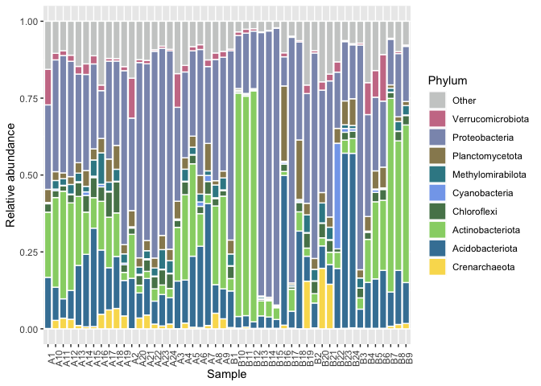

Relative Abundance
================

## Relative abundance

Relative abundance is a proportion of a specific taxa in the community
and it may calculated by sample. Relative abundace is the ratio bewteen
the number of sequences of and specific taxonomic group and the total
sequences obtained in a sample.

## Get data

To calculate relative abundance, we’ll use two datasets, the file which
contains de number of sequences after quality control, in my case I
called it “denoising-stats.tsv” (it is in “datasets” directory) and the
number of sequences per taxonomic group. To obtain the second file we
need to use the plugin `qiime taxa barplot` after make the taxonomic
classification and download the `.csv` files from each taxonomic
hierarchy (level). See the image below.

``` r
  knitr::include_graphics("images/taxaBarplots.png")
```

<div class="figure" style="text-align: center">


<p class="caption">

Taxa barplots from QIIME2 .

</p>

</div>

Remember:

  - level-1: Domain
  - level-2: Phylum
  - level-3: Class
  - level-4: Order
  - level-5: Family
  - level-6: Genus
  - level-7: Specie

In “denoising-stats.csv” we have several columns indicating the number
of recovered sequences after each process of quality control.

``` r
library(tidyverse)
library(magrittr)

total.seqs <- read.table("datasets/denoising-stats.tsv", sep = '\t', header = TRUE)
names(total.seqs)
```

    ## [1] "sample.id"                         "input"                            
    ## [3] "filtered"                          "percentage.of.input.passed.filter"
    ## [5] "denoised"                          "merged"                           
    ## [7] "percentage.of.input.merged"        "non.chimeric"                     
    ## [9] "percentage.of.input.non.chimeric"

So, the idea is divide the number of sequences of some taxa from one
taxonomic hierarchy (“level-x.csv”) between the total of sequences
(column ‘non-chimeric’ in “denoised-stats.tsv” file).

## Data wrangling

From “denoised-stats.tsv” file we’ll just use the column called
‘non-chimeric’ and the samples ids.

``` r
total.seqs %<>% 
  select(sample.id, non.chimeric) %>%
  arrange()

head(total.seqs)
```

    ##   sample.id non.chimeric
    ## 1        A1        30038
    ## 2        A2        23971
    ## 3        A3        31950
    ## 4        A4       367162
    ## 5        A5       644316
    ## 6        A6       245907

The datasets “level-x.csv” are a little more complicated. For this
example I will use “level-2.csv”, which corresponds to the taxonomic
hierarchy of phylum. The dataset “level-2.csv” contains on the columns
names: 1) a column called ‘index’ which contains your samples ids,

``` r
phy <- read.csv("datasets/level-2.csv", header = TRUE)
head(phy$index, 10)
```

    ##  [1] "A1"  "A2"  "A3"  "A4"  "A5"  "A6"  "A7"  "A8"  "A9"  "A10"

2)  Several columns with the taxonomy at the level of phylum including
    the domain,

<!-- end list -->

``` r
head(colnames(phy))
```

    ## [1] "index"                         "d__Archaea.__"                
    ## [3] "d__Archaea.p__Aenigmarchaeota" "d__Archaea.p__Asgardarchaeota"
    ## [5] "d__Archaea.p__Crenarchaeota"   "d__Archaea.p__Euryarchaeota"

and , 3) at the end the dataset, the categorical varibles you assigned
in your sample-metadata file. In this case, the categorical varibles are
‘sample\_type’ and ‘site’.

``` r
tail(colnames(phy))
```

    ## [1] "d__Bacteria.p__WPS.2"        "d__Bacteria.p__WS1"         
    ## [3] "d__Bacteria.p__WS2"          "d__Bacteria.p__Zixibacteria"
    ## [5] "sample_type"                 "site"

First, delete the categorical variables.

``` r
phy %<>% 
  select(-c(sample_type, site)) 
```

Then, you can use the function `rel_ab(dataTax, dataTotSeq, iTax,
iTotSeq)` which is contained in “fun\_relative\_abundance.R” in
“scripts” directory. This function has four parameters:

  - `dataTax`: Dataset with groups of a taxonomic hierarchy (this case,
    phy from ‘level-2.csv’ file.)
  - `dataTotSeq`: Dataset with the samples names and the number of total
    sequences by sample.
  - `iTax`: Column number where the samples names are found in
    datasetTax (usually 1)
  - `iTotSeq`: Column number where the samples names are found in
    datasetTax (usually 1).

<!-- end list -->

``` r
source("scripts/fun_relative_abundance.R")

relative.abundance.phy <- rel_ab(phy, total.seqs, 1, 1) 
```

Now, we have the proportion form each phylum detected by sample in the
dataset `relative.abundance.phy`.

``` r
head(relative.abundance.phy[1:5], 5)
```

    ##   d__Archaea.__ d__Archaea.p__Aenigmarchaeota d__Archaea.p__Asgardarchaeota
    ## 1             0                  0.0000000000                             0
    ## 2             0                  0.0000000000                             0
    ## 3             0                  0.0000000000                             0
    ## 4             0                  0.0001470740                             0
    ## 5             0                  0.0001458911                             0
    ##   d__Archaea.p__Crenarchaeota d__Archaea.p__Euryarchaeota
    ## 1                0.0010653173                0.000000e+00
    ## 2                0.0004588878                0.000000e+00
    ## 3                0.0004694836                0.000000e+00
    ## 4                0.0187056395                2.995953e-05
    ## 5                0.0052489772                0.000000e+00

As you can notice, we lost our samples names, let’s recover them.

``` r
rownames(relative.abundance.phy) <- phy$index
head(relative.abundance.phy[1:5], 5)
```

    ##    d__Archaea.__ d__Archaea.p__Aenigmarchaeota d__Archaea.p__Asgardarchaeota
    ## A1             0                  0.0000000000                             0
    ## A2             0                  0.0000000000                             0
    ## A3             0                  0.0000000000                             0
    ## A4             0                  0.0001470740                             0
    ## A5             0                  0.0001458911                             0
    ##    d__Archaea.p__Crenarchaeota d__Archaea.p__Euryarchaeota
    ## A1                0.0010653173                0.000000e+00
    ## A2                0.0004588878                0.000000e+00
    ## A3                0.0004694836                0.000000e+00
    ## A4                0.0187056395                2.995953e-05
    ## A5                0.0052489772                0.000000e+00

Usually, we want to know the most abundant taxa in the samples. So, we
can filter the dataset with the function `filter_abundances()` in the
script “fun\_relative\_abundance.R” in “scripts” directory. The function
`filter_abundances()` has two parameters: - `dataRelAb`: The dataset
with the relative abundances of each taxa (in this case
‘relative.abundance.phy’). - `filterValue`: The minimum value of
relative abundance that we want.

``` r
source("scripts/fun_relative_abundance.R")

phy.filtered <- filter_abundances(relative.abundance.phy, 0.10)
head(phy.filtered[1:5], 5)
```

    ##                                          A1           A2           A3
    ## d__Archaea.p__Crenarchaeota     0.001065317 0.0004588878 0.0004694836
    ## d__Bacteria.p__Acidobacteriota  0.166355949 0.1637395186 0.1548982786
    ## d__Bacteria.p__Actinobacteriota 0.211898262 0.1431312836 0.1745852895
    ## d__Bacteria.p__Chloroflexi      0.027198881 0.0203579325 0.0229107981
    ## d__Bacteria.p__Cyanobacteria    0.001764432 0.0027950440 0.0032237872
    ##                                         A4          A5
    ## d__Archaea.p__Crenarchaeota     0.01870564 0.005248977
    ## d__Bacteria.p__Acidobacteriota  0.13988103 0.230860323
    ## d__Bacteria.p__Actinobacteriota 0.27753689 0.300408495
    ## d__Bacteria.p__Chloroflexi      0.04125155 0.028611737
    ## d__Bacteria.p__Cyanobacteria    0.00261465 0.001548929

And, It only remains to clear the names of the phyla.

``` r
phy.data <-  phy.filtered %>%
  rownames_to_column(var = "ID") %>% 
  separate(ID, c("Domain", "Phylum"), sep = ".p__") %>%
  select(-Domain)

head(phy.data[1:6], 5)
```

    ##             Phylum          A1           A2           A3         A4          A5
    ## 1    Crenarchaeota 0.001065317 0.0004588878 0.0004694836 0.01870564 0.005248977
    ## 2  Acidobacteriota 0.166355949 0.1637395186 0.1548982786 0.13988103 0.230860323
    ## 3 Actinobacteriota 0.211898262 0.1431312836 0.1745852895 0.27753689 0.300408495
    ## 4      Chloroflexi 0.027198881 0.0203579325 0.0229107981 0.04125155 0.028611737
    ## 5    Cyanobacteria 0.001764432 0.0027950440 0.0032237872 0.00261465 0.001548929

Remeber this data are proportional, so the sum of each sample (column)
must be 1, but, because of we just select the most abundat taxa, our sum
will be less than 1.

``` r
phy.data %>%
  select(-Phylum) %>%
  summarise_all(sum)
```

    ##          A1        A2        A3        A4        A5        A6        A7
    ## 1 0.8436647 0.8149431 0.8297027 0.8564612 0.9174179 0.9237801 0.8743148
    ##          A8        A9       A10       A11       A12       A13       A14
    ## 1 0.8967831 0.9019758 0.8957768 0.9038895 0.8896359 0.8532599 0.8614741
    ##         A15       A16       A17       A18       A19       A20       A21
    ## 1 0.8877661 0.7925261 0.8792344 0.8783366 0.8525158 0.8750713 0.8728897
    ##         A22       A23       A24        B1        B2        B3        B4
    ## 1 0.9074493 0.9190625 0.9088739 0.9093883 0.9041883 0.9289589 0.8003762
    ##          B5        B6        B7        B8        B9       B10       B11
    ## 1 0.8398433 0.8917164 0.9447753 0.9013743 0.9226801 0.9653996 0.9740373
    ##         B12       B13       B14       B15       B16       B17       B18
    ## 1 0.9758169 0.9655164 0.9700994 0.9788416 0.8973459 0.9516367 0.9369726
    ##         B19       B20       B21       B22       B23       B24
    ## 1 0.7925642 0.8030281 0.8281599 0.8678804 0.9373499 0.9273442

If you want, you can add an observation called “Others”, it refers the
other taxa that have a ratio less than 0.10. And you can add a row with
“Other” with the function `other_row()`, its parameters are: -
`dataset`: name of the dataset - `i`: number of column whit the taxa
(usually 1)

``` r
source("scripts/fun_relative_abundance.R")

phy.data1 <- other_row(phy.data, 1) 
head(phy.data1[1:5], 10)
```

    ##               Phylum          A1           A2           A3         A4
    ## 1      Crenarchaeota 0.001065317 0.0004588878 0.0004694836 0.01870564
    ## 2    Acidobacteriota 0.166355949 0.1637395186 0.1548982786 0.13988103
    ## 3   Actinobacteriota 0.211898262 0.1431312836 0.1745852895 0.27753689
    ## 4        Chloroflexi 0.027198881 0.0203579325 0.0229107981 0.04125155
    ## 5      Cyanobacteria 0.001764432 0.0027950440 0.0032237872 0.00261465
    ## 6  Methylomirabilota 0.002563420 0.0012932293 0.0009389671 0.03905905
    ## 7    Planctomycetota 0.042546108 0.0525635142 0.0578090767 0.03698095
    ## 8     Proteobacteria 0.274751981 0.3007801093 0.3055086072 0.27914653
    ## 9  Verrucomicrobiota 0.115520341 0.1298235368 0.1093583725 0.02128488
    ## 10             Other 0.156335309 0.1850569438 0.1702973396 0.14353882

## Ploting

Finally, you can plot the last dataset generated with `ggplot2`. Site
for choose palettes:
[Coolors](https://coolors.co/54494b-7e8287-9da39a-b98389-db2955).

``` r
phy.names <- phy.data1$Phylum
phy.data1$Phylum <- factor(phy.data1$Phylum, levels = rev(phy.names))

my_colors <- c("#CBCDCC", "#CB7C95", "#8C97BA", "#97895E", "#388894",
               "#83A8EC", "#568259", "#97D274", "#4281A4", "#F9DC5C")

taxbarplot <- phy.data1 %>%
  pivot_longer(cols = (2:length(colnames(.)))) %>%
  ggplot(aes(x = name, y = value, fill = Phylum)) +
  scale_fill_manual(values = my_colors) +
  geom_bar(stat = "identity", position = "stack", color = "white") +
  theme(
    axis.text.x = element_text(angle = 90)
  ) +
  labs(
    x = "Sample", 
    y = "Relative abundance" 
  )
taxbarplot
```

<!-- -->
