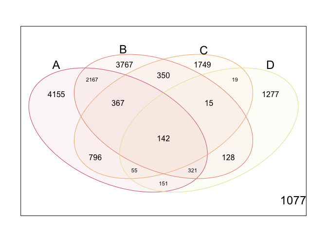

Venn Diagram: Shared ASVs
================
Luis-Vargas Maira N

# Libraries

The special library you need is `limma`.

``` r
library(tidyverse)
library(magrittr)
library(reshape2) #to melt dataset
library(limma)
```

# Data preparation

We’ll use the `otu_tax_matrix.csv` file, it was generated with
`taxonomy.tsv` file and `feature-table.tsv` file (see the tuto ’(Files
preparation and importing to
`phyloseq`)\[<https://github.com/Nayeli-Luis/16SrRNA_FromQIIME2_ToR/blob/main/tutorials/phyloseq-files-preparation-importing.md>\]).

The colnames of the `otu_tax_matrix.csv` looks like this:

``` r
otu.tax <- read_csv('../datasets/otu_tax_matrix.csv')

colnames(otu.tax)
```

    ##  [1] "OTUID"   "A1"      "A2"      "A3"      "A4"      "A5"      "A6"     
    ##  [8] "A7"      "A8"      "A9"      "A10"     "B1"      "B2"      "B3"     
    ## [15] "B4"      "B5"      "B6"      "B7"      "B8"      "B9"      "B10"    
    ## [22] "C1"      "C2"      "C3"      "C4"      "C5"      "C6"      "C7"     
    ## [29] "C8"      "C9"      "C10"     "D1"      "D2"      "D3"      "D4"     
    ## [36] "D5"      "D6"      "D7"      "D8"      "D9"      "D10"     "Kingdom"
    ## [43] "Phylum"  "Class"   "Order"   "Family"  "Genus"   "Specie"

It contains the `OTUID` variable with the ASV identifier, your samples
(in this case from `A1` to `D10`) with the counts of each ASV and a
column by each taxonomic hierarchy (from `Kingdom` to `Specie`).

In this `otu_tax_matrix.csv` we have four sites (A, B, C and D) with 10
repetitions. We want to **know how many ASVs shared between them**.

Let’s check dimension.

``` r
dim(otu.tax)
```

    ## [1] 16536    48

## Step 1. Copy-paste

Save a copy of `otu.tax`, because we will use it to search the taxonomic
classification of the ASVs shared.

``` r
otu.tax.copy <- otu.tax
```

## Step 2. Transform to long format

Transform the dataset to long format with `melt()`.

``` r
otu.tax %<>% melt() 
```

    ## Using OTUID, Kingdom, Phylum, Class, Order, Family, Genus, Specie as id variables

``` r
colnames(otu.tax)
```

    ##  [1] "OTUID"    "Kingdom"  "Phylum"   "Class"    "Order"    "Family"  
    ##  [7] "Genus"    "Specie"   "variable" "value"

You will have two new columns `variable` and `value`, `variable` is the
name of the samples and `value` the count of your ASVs.

Let’s check dimension, as you can see you have more observations.

``` r
dim(otu.tax)
```

    ## [1] 661440     10

## Stept 3. Obtain sum of ASVs by site.

At this moment, we don’t need each repetition of site, because we want
to compare between our four sites (not betwenn our 40 samples). So,
we’ll add a new variable called `site`, obviously it will be a category.
It is easy with the function `case_when()` and `grepl()`

``` r
# Create new variable

otu.tax %<>% 
  mutate(site = case_when(
    grepl("A", variable) ~ "A",
    grepl("B", variable) ~ "B",
    grepl("C", variable) ~ "C",
    grepl("D", variable) ~ "D"
  ))
```

Now we’ll group by site and get the mean of ASVs of each site.

``` r
otu.tax %<>%
  group_by(OTUID, site) %>%
  summarise(across(value, .fns = list(sum = sum)))

head(otu.tax)
```

    ## # A tibble: 6 x 3
    ## # Groups:   OTUID [2]
    ##   OTUID                            site  value_sum
    ##   <chr>                            <chr>     <dbl>
    ## 1 00036a009561f213d4ce34976272a74e A            14
    ## 2 00036a009561f213d4ce34976272a74e B            13
    ## 3 00036a009561f213d4ce34976272a74e C             0
    ## 4 00036a009561f213d4ce34976272a74e D             0
    ## 5 000492f90810f8c40399573f9b78fbf4 A            54
    ## 6 000492f90810f8c40399573f9b78fbf4 B             0

## Step 4. Tranform to wide format

``` r
otu.tax %<>% 
  pivot_wider(names_from = "site", values_from = "value_sum")
head(otu.tax)
```

    ## # A tibble: 6 x 5
    ## # Groups:   OTUID [6]
    ##   OTUID                                A     B     C     D
    ##   <chr>                            <dbl> <dbl> <dbl> <dbl>
    ## 1 00036a009561f213d4ce34976272a74e    14    13     0     0
    ## 2 000492f90810f8c40399573f9b78fbf4    54     0     0     0
    ## 3 0006d142c7d8d12f6a25328b73d993b3     8     0     0     0
    ## 4 000c2c548d916008a072ecb085317efb    23     0     0     0
    ## 5 000fd226d21abb5d0c38bfb05f7e9fa5     0     0     9     0
    ## 6 00130d1108179cf86d8ef16c2858f706     0     0     0     0

## Step 5. Generate presence/absence matrix

In this step we mark the absence of presence of an ASV with 1 and 0 by
site. If the sum of ASVs is greater than or equal to 1, we’ll mark 1, if
not, we’ll mark 0.

``` r
count_matrix <- otu.tax %>%
  transmute(
    OTUID,
    A = if_else(A >= 1, 1, 0), 
    B = if_else(B >= 1, 1, 0),
    C = if_else(C >= 1, 1, 0),
    D = if_else(D >= 1, 1, 0)
  )

head(count_matrix)
```

    ## # A tibble: 6 x 5
    ## # Groups:   OTUID [6]
    ##   OTUID                                A     B     C     D
    ##   <chr>                            <dbl> <dbl> <dbl> <dbl>
    ## 1 00036a009561f213d4ce34976272a74e     1     1     0     0
    ## 2 000492f90810f8c40399573f9b78fbf4     1     0     0     0
    ## 3 0006d142c7d8d12f6a25328b73d993b3     1     0     0     0
    ## 4 000c2c548d916008a072ecb085317efb     1     0     0     0
    ## 5 000fd226d21abb5d0c38bfb05f7e9fa5     0     0     1     0
    ## 6 00130d1108179cf86d8ef16c2858f706     0     0     0     0

Transform the `count_matrix` dataset to a matrix.

``` r
count_matrix1 <- count_matrix %>%
  as.data.frame() %>%
  set_rownames(., .$OTUID) %>%
  select(-OTUID) %>%
  as.matrix()

head(count_matrix1)
```

    ##                                  A B C D
    ## 00036a009561f213d4ce34976272a74e 1 1 0 0
    ## 000492f90810f8c40399573f9b78fbf4 1 0 0 0
    ## 0006d142c7d8d12f6a25328b73d993b3 1 0 0 0
    ## 000c2c548d916008a072ecb085317efb 1 0 0 0
    ## 000fd226d21abb5d0c38bfb05f7e9fa5 0 0 1 0
    ## 00130d1108179cf86d8ef16c2858f706 0 0 0 0

# Venn Diagram: `limma` in action

Here `limma` checks the categories (in this case sites) whose shared
ones, in `count_matrix`.

``` r
venn_counts <- vennCounts(count_matrix1)
venn_counts
```

    ##    A B C D Counts
    ## 1  0 0 0 0   1077
    ## 2  0 0 0 1   1277
    ## 3  0 0 1 0   1749
    ## 4  0 0 1 1     19
    ## 5  0 1 0 0   3767
    ## 6  0 1 0 1    128
    ## 7  0 1 1 0    350
    ## 8  0 1 1 1     15
    ## 9  1 0 0 0   4155
    ## 10 1 0 0 1    151
    ## 11 1 0 1 0    796
    ## 12 1 0 1 1     55
    ## 13 1 1 0 0   2167
    ## 14 1 1 0 1    321
    ## 15 1 1 1 0    367
    ## 16 1 1 1 1    142
    ## attr(,"class")
    ## [1] "VennCounts"

With this data we can generate the Venn Diagram.

``` r
my.colors<- c("#CF587E", "#E98571", "#EDB479", "#E9E19C")
vennDiagram(venn_counts, circle.col = my.colors)
```

<!-- -->

We can see that all the sites shared 142 ASVs… Who are them?

# Taxa classification of shared ASVs

Time to use our copy of `otu.tax` and `count_matrix`. Of `otu.tax.copy`
we just need the taxa.

``` r
otu.tax.copy %<>%
  select(OTUID, Kingdom:Specie)
head(otu.tax.copy)
```

    ## # A tibble: 6 x 8
    ##   OTUID       Kingdom  Phylum    Class    Order    Family    Genus    Specie    
    ##   <chr>       <chr>    <chr>     <chr>    <chr>    <chr>     <chr>    <chr>     
    ## 1 00036a0095… Bacteria Desulfob… uncultu… uncultu… uncultur… uncultu… metagenome
    ## 2 000492f908… Bacteria NB1-j     NB1-j    NB1-j    NB1-j     NB1-j    unculture…
    ## 3 0006d142c7… Bacteria Myxococc… bacteri… bacteri… bacteria… bacteri… unculture…
    ## 4 000c2c548d… Bacteria Proteoba… Alphapr… Paracae… Paracaed… Candida… unculture…
    ## 5 000fd226d2… Bacteria Proteoba… Alphapr… Rhodosp… uncultur… uncultu… unculture…
    ## 6 00130d1108… Bacteria Firmicut… Bacilli  Thermoa… Thermoac… Planifi… unculture…

We want to know the taxonomic classification of the ASVs that are
present in all sites, I mean, the ASVs with 1 in all the sites.

So, first, we’ll create a vector with that ASVs.

``` r
asv_interest <- count_matrix %>%
  filter(A == 1 & B == 1 & C == 1 & D == 1) %>%
  .$OTUID

head(asv_interest)
```

    ## [1] "03057f5610ccc9aa94e35bbc65e81c8c" "04742cc06f8f5b38a7c8399a836c6466"
    ## [3] "0ad39b7b7deb1ce173823cde35e708d3" "0bf5302ab9b13018515b08c69798db49"
    ## [5] "0c2d219a010e3b69d07eadfb9416bbb9" "0c4044221ce447bccf82e751ba1d0d8c"

Check if there are 142.

``` r
length(asv_interest)
```

    ## [1] 142

Then we’ll search that OTUIDs in `otu.tax.copy`.

``` r
tax_asv <- filter(otu.tax.copy, OTUID %in% asv_interest)

head(tax_asv)
```

    ## # A tibble: 6 x 8
    ##   OTUID         Kingdom  Phylum    Class    Order    Family    Genus   Specie   
    ##   <chr>         <chr>    <chr>     <chr>    <chr>    <chr>     <chr>   <chr>    
    ## 1 03057f5610cc… Bacteria Bacteroi… Bactero… Cytopha… Microsci… uncult… <NA>     
    ## 2 04742cc06f8f… Bacteria Acidobac… Subgrou… Subgrou… Subgroup… Subgro… uncultur…
    ## 3 0ad39b7b7deb… Bacteria Bacteroi… Bactero… Chitino… Chitinop… Ferrug… <NA>     
    ## 4 0bf5302ab9b1… Bacteria Acidobac… Holopha… Subgrou… Subgroup… Subgro… <NA>     
    ## 5 0c2d219a010e… Bacteria Planctom… Phycisp… S-70     S-70      S-70    uncultur…
    ## 6 0c4044221ce4… Bacteria Actinoba… Actinob… Pseudon… Pseudono… Crossi… uncultur…

And that’s all, continue crying with your analysis. Hope it helps you.
